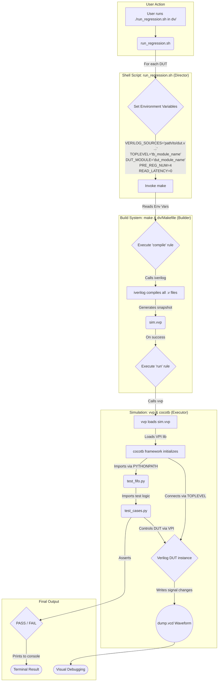

# FIFO/RAM Wrapper 生成及验证平台

本文档包含两部分：第一部分介绍如何使用脚本生成 Verilog Wrapper 文件，第二部分介绍如何使用 `cocotb` 验证平台对生成的 Wrapper 进行回归测试。

---

## 第一部分：Wrapper 代码生成

### 1.1 概述

本目录的核心功能是作为项目中所有 Memory 和 FIFO 相关模型的 **Central Repository** (中心仓库) 和 **Parameterized Generation Point** (参数化生成点)。

- **Central Repository**: 它是项目中所有底层 SRAM 模型和其他公共模块的唯一来源。项目的其他部分在需要使用 Memory 或 FIFO IP 时，都应从此处获取，以确保设计的一致性和标准化。
- **Parameterized Generation Point**: 它提供了一套自动化机制 (如 `auto_gen_local.py` 脚本)，可以根据您输入的参数（如 `DEPTH`, `WIDTH`, `PORT_TYPE` 等），自动“生产”出符合特定需求的 Verilog 模块。

### 1.2 文件结构与功能

- **`auto_gen_local.py`**: 用于在本地生成 Verilog wrapper 的核心 Python 脚本。它接收一系列命令行参数来填充 Verilog 模板。
- **`auto_gen_app` / `auto_gen_mep` 等**: 这些文件包含了针对不同应用场景、预设好参数的命令列表，用于调用 `auto_gen_local.py`。
- **`module_*.v`**: 各种 FIFO 架构的 Verilog 模板文件 (如 `module_fifo.v`, `module_fwft_fifo.v`)。
- **`tp_ram.v` / `tpuhd_ram.v`**: RAM 模块本身的 Verilog 模板。

### 1.3 Wrapper 生成流程

1.  **确保模板文件存在**: 
    `auto_gen_local.py` 脚本的运行依赖于一系列 Verilog 模板文件。在执行脚本前，请确保以下这些关键的模板文件存在于 `wrapper_generation` 目录中：
    -   `module_fifo.v`
    -   `module_fwft_fifo.v`
    -   `module_afifo.v`
    -   `module_fwft_afifo.v`
    -   `tp_ram.v`
    -   `tpuhd_ram.v`
    -   `TP_RAM_INST` 及其他实例化模板

    如果缺少这些模板文件，脚本在尝试读取它们时会因“文件未找到”而失败。

2.  **运行生成脚本**: 在 `wrapper_generation` 目录下，执行 `auto_gen_local.py` 并提供所有必需的参数。

    **参数说明:**
    | 序号 | 参数名        | 含义                     | 示例值        |
    |------|---------------|--------------------------|---------------|
    | 1    | `PORT_NUM`      | 端口类型 (e.g., `TPUHD`)   | `TPUHD`       |
    | 2    | `MEMORY_TYPE`   | 存储器类型               | `SRAM`        |
    | 3    | `RAM_DEPTH`     | 存储深度                 | `2048`        |
    | 4    | `DATA_WIDTH`    | 数据位宽                 | `128`         |
    | 5    | `PERIP_VT`      | 外围电路 VT 类型         | `SVT`         |
    | 6    | `BIT_WRITE`     | 位写使能                 | `0`           |
    | 7    | `MULTIP`        | 乘法器配置               | `8`           |
    | 8    | `BANK`          | Bank 编号                | `4`           |
    | 9    | `REDUNDANCY`    | 冗余标志                 | `0`           |
    | 10   | `LOW_POWER`     | 低功耗模式               | `0`           |
    | 11   | `INPUT_PIPE`    | 输入流水线级数           | `0`           |
    | 12   | `OUTPUT_PIPE`   | 输出流水线级数           | `0`           |
    | 13   | `ADDR_WIDTH`    | 地址位宽                 | `11`          |
    | 14   | `MODULE_NAME`   | 模块基础名称             | `as6s_vp_buffer`|
    | 15   | `FILE_PATH`     | 输出文件夹名称           | `as6s_app`    |
    | 16+  | `commands`      | 要生成的 wrapper 类型    | `fifo`, `ram` |

    **示例:**
    ```sh
    python auto_gen_local.py TPUHD SRAM 2048 128 SVT 0 8 4 0 0 0 0 11 as6s_vp_buffer as6s_app fifo fwft_fifo ram
    ```

---

## 第二部分：Cocotb 验证平台

### 2.1 概述

这是一个基于 `cocotb` 和 `iverilog` 的自动化 Verilog 回归测试平台。它被设计用于对第一部分生成的多种 FIFO `wrapper` 设计进行一键化的批量功能验证，并具备生成波形进行可视化调试的能力。

整个验证环境运行在 **WSL (Windows Subsystem for Linux)** 中，以确保开源工具链的稳定性和兼容性。

### 2.2 环境配置 (一次性操作)

在开始验证之前，您需要按以下步骤配置好 WSL 环境。所有命令都在 **WSL (Ubuntu) 终端**中执行。

1.  **安装核心工具链**:
    ```bash
    sudo apt update
    sudo apt install make iverilog python3.13-dev python3.13-venv python3-pip -y
    ```

2.  **创建 Python 虚拟环境**:
    ```bash
    cd ~
    python3.13 -m venv py313_cocotb_venv
    ```

3.  **安装 `cocotb`**:
    ```bash
    source ~/py313_cocotb_venv/bin/activate
    pip install cocotb
    ```

4.  **将项目代码复制到 WSL 中**:
    ```bash
    cd ~
    cp -r /mnt/d/code/linux_scripts/COMRTL .
    ```

### 2.3 验证平台文件结构

`wrapper_generation` 目录下的核心验证结构如下：

```text
wrapper_generation/
|-- as6s_app/                  # 存放生成的 Verilog wrapper 文件
|   |-- *.v                    # DUT (Design Under Test) 文件
|   `-- tb/                    # Testbench 相关文件
|       |-- tests/
|       |   `-- test_cases.py`  # 包含具体的 Python 测试逻辑
|       |-- test_fifo.py       # Test runner, 调用 test_cases.py 中的测试
|       |-- tb_fwft_fifo.v     # 用于例化 FWFT FIFO 的 Verilog Toplevel
|       `-- tb_standard_fifo.v # 用于例化 Standard FIFO 的 Verilog Toplevel
|
|-- dv/                        # Design Verification, 存放回归控制文件
|   |-- Makefile             # 参数化的 Makefile, 负责编译和运行
|   `-- run_regression.sh`    # 顶层一键化回归脚本
|
`-- ... (其他生成器模板文件)
```

### 2.4 如何执行回归测试

每次您想运行完整的回归测试时，请按以下步骤操作：

1.  **打开 WSL (Ubuntu) 终端**。

2.  **激活 Python 虚拟环境**:
    ```bash
    source ~/py313_cocotb_venv/bin/activate
    ```

3.  **进入 `dv` 目录**:
    ```bash
    cd ~/COMRTL/FIFO/wrapper_generation/dv
    ```

4.  **运行回归脚本**:
    ```bash
    ./run_regression.sh
    ```

### 2.5 平台工作流程详解

当您运行 `./run_regression.sh` 时，脚本会驱动各个组件协同工作，其流程和数据流如下：

1.  **`run_regression.sh` (总指挥)**:
    -   **读取**: 无。它是流程的起点。
    -   **操作**: 负责定义要测试的 DUT 列表。它为每个 DUT 准备一套独特的**环境变量** (如 `VERILOG_SOURCES`, `TOPLEVEL`, `READ_LATENCY`)，然后调用 `make` 命令。
    -   **输出**: 将变量传递给 `make`。

2.  **`make` & `dv/Makefile` (建造者)**:
    -   **读取**: 接收来自 `run_regression.sh` 的变量。
    -   **操作**: 调用 `iverilog` 工具，将 `VERILOG_SOURCES` 列表中的所有 Verilog 文件编译成一个可执行的仿真快照 `sim.vvp`。
    -   **输出**: 生成 `sim.vvp` 文件。

3.  **`vvp` & `cocotb` (执行者与测试员)**:
    -   **读取**: `make` 命令调用 `vvp` 来执行 `sim.vvp` 文件。
    -   **操作**: 
        -   `vvp` 加载 `cocotb` 的 VPI 库 (`libcocotbvpi_icarus.so`)，启动 Python 解释器。
        -   `cocotb` 框架根据 `PYTHONPATH` 环境变量找到并 `import` **`as6s_app/tb/test_fifo.py`**。
        -   `test_fifo.py` 再 `import` **`as6s_app/tb/tests/test_cases.py`** 中的具体测试逻辑。
        -   `cocotb` 根据 `TOPLEVEL` 环境变量 (如 `tb_fwft_fifo.dut`) 连接到 Verilog 设计中的 `dut` 实例。
        -   测试代码 (`test_cases.py`) 开始执行，通过 VPI 接口与 Verilog 设计进行交互。
    -   **输出**: 在终端打印 `PASS`/`FAIL` 日志，并根据 Verilog Toplevel 中的 `$dumpvars` 指令生成 `.vcd` 波形文件。

### 2.6 流程可视化 (Mermaid 图)

以下流程图以图形化的方式展示了上述工作流程：


