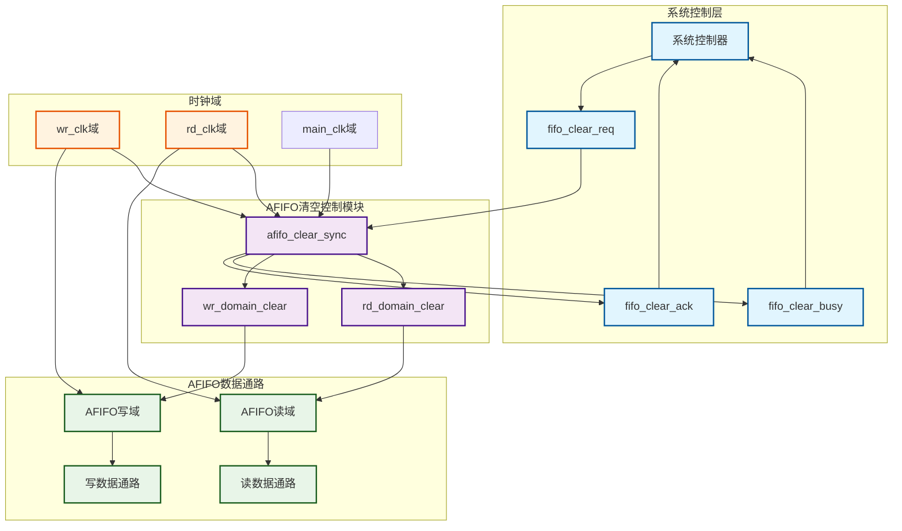
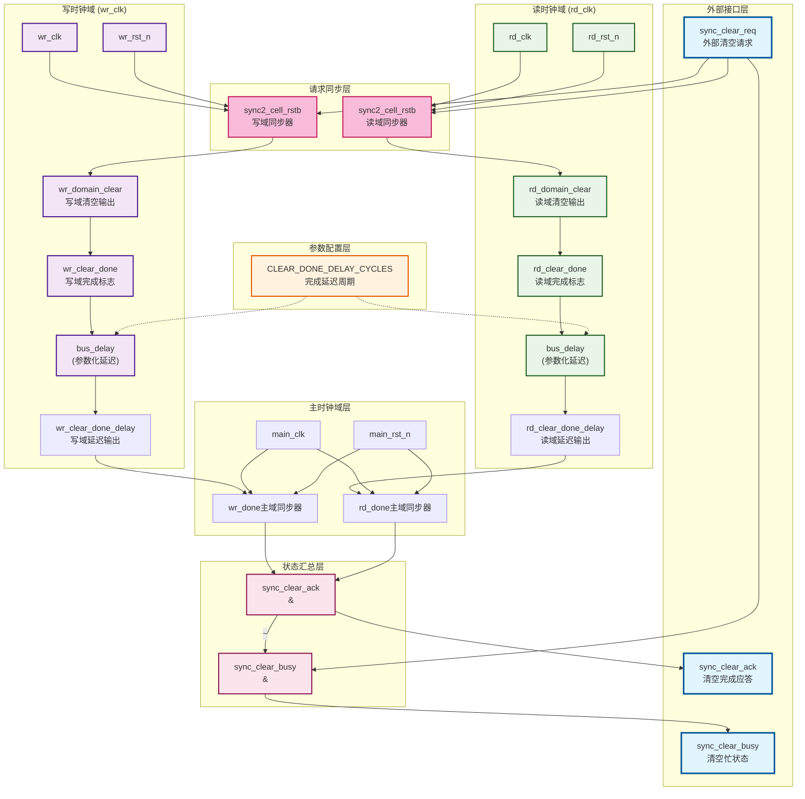

# AFIFO跨时钟域同步清空控制模块

## 模块概述

`afifo_clear_sync.v` 是一个专门设计用于异步FIFO跨时钟域同步清空的控制模块。该模块实现了安全的跨域信号同步、完整的握手协议以及统一的主时钟域状态管理机制，确保AFIFO执行同步清空操作，避免output对下游模块产生亚稳态。

## 功能说明

### 核心功能
1. **跨域同步**: 将外部清空请求安全地同步到读写时钟域
2. **握手协议**: 实现完整的清空请求-应答握手机制
3. **状态管理**: 统一在主时钟域进行清空完成状态汇总
4. **延迟控制**: 可配置的清空完成延迟周期
5. ****: 

### 工作原理
1. **请求阶段**: 外部`sync_clear_req`通过两个独立的同步器分别同步到写域和读域
2. **执行阶段**: 各时钟域接收到清空信号后执行内部清空操作
3. **检测阶段**: 模块内部检测各域清空完成状态，经过可配置延迟后
4. **反馈阶段**: 完成状态统一同步到主时钟域，生成全局应答信号

## 与其他模块连接示意图



### 典型连接示例

```verilog
// 1. 系统级控制器
system_controller u_sys_ctrl (
    .fifo_clear_request(fifo_clear_req),    // 发起清空请求
    .fifo_clear_complete(fifo_clear_ack),   // 接收清空完成
    .fifo_clear_status(fifo_clear_busy)     // 监控清空状态
);

// 2. 跨域同步清空模块
afifo_clear_sync #(
    .CLEAR_DONE_DELAY_CYCLES(3)
) u_clear_sync (
    .wr_clk(wr_clk),
    .wr_rst_n(wr_rst_n),
    .rd_clk(rd_clk),
    .rd_rst_n(rd_rst_n),
    .main_clk(main_clk),                    // 主时钟域
    .main_rst_n(main_rst_n),               // 主域复位
    .sync_clear_req(fifo_clear_req),
    .sync_clear_ack(fifo_clear_ack),
    .sync_clear_busy(fifo_clear_busy),
    .wr_domain_clear(wr_domain_clear),
    .rd_domain_clear(rd_domain_clear)
);

// 3. AFIFO数据通路
afifo_wrapper u_afifo (
    .wr_clk(wr_clk),
    .rd_clk(rd_clk),
    .wr_domain_clear(wr_domain_clear),      // 接收写域清空
    .rd_domain_clear(rd_domain_clear),      // 接收读域清空
    // ... 其他标准AFIFO端口
);
```

## 内部实现示意图



### 内部信号流程

1. **请求同步阶段**
   - 外部`sync_clear_req`同时输入到两个`sync2_cell_rstb`同步器
   - 分别在`wr_clk`和`rd_clk`域产生同步的清空信号

2. **域内处理阶段**
   - 各域检测到清空信号后立即设置完成标志
   - 通过可配置的`bus_delay`模块增加稳定延迟
   - 确保清空操作有足够时间完成

3. **完成同步阶段**
   - 根据参数配置选择完成信号的同步目标域
   - 使用额外的`sync2_cell_rstb`进行跨域同步
   - 实现灵活的时钟域汇总策略

4. **状态输出阶段**
   - `sync_clear_ack`: 两个域完成信号的逻辑与
   - `sync_clear_busy`: 请求有效但未完成的状态指示

## 参数化说明

### 参数定义

| 参数名称 | 类型 | 默认值 | 取值范围 | 功能说明 |
|----------|------|--------|----------|----------|
| `CLEAR_DONE_DELAY_CYCLES` | integer | 3 | 1-15 | 清空完成信号延迟周期数 |

### 参数详细说明

#### CLEAR_DONE_DELAY_CYCLES

**功能**: 控制清空完成信号的延迟周期数，确保内部状态稳定后再进行跨域同步

**选择建议**:
```verilog
// 标准应用 - 推荐值
.CLEAR_DONE_DELAY_CYCLES(3)
```

**设计说明**:
- 延迟周期数应该大于等于同步器级数，确保状态稳定
- AFIFO内部multi_bit_sync2_cell_rstb保持两级打拍不变，则不改变该参数
- 过小的延迟可能导致状态不稳定
- 过大的延迟会增加清空完成时间

### 时钟域配置

**新设计特点**:

- 统一使用`main_clk`域进行状态汇总
- 简化了参数配置，提高了可维护性
- 减少了时钟域选择的复杂性

**版本信息**: afifo_clear_sync v1.0  
**更新日期**: 2025年10月10日  
**兼容性**: 支持Verilog-2001及以上标准  
**依赖模块**: sync2_cell_rstb, bus_delay